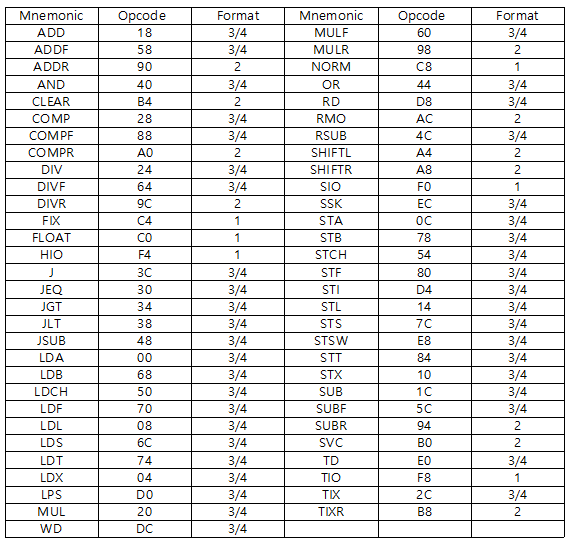
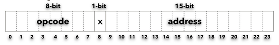
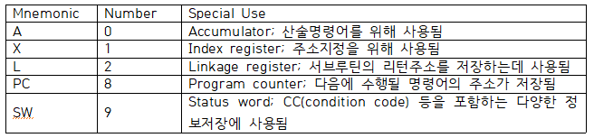
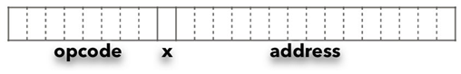
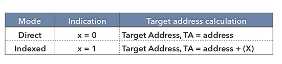
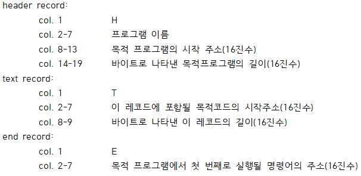
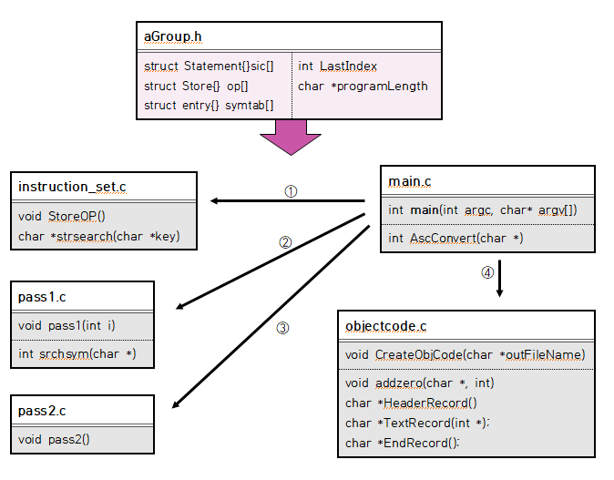
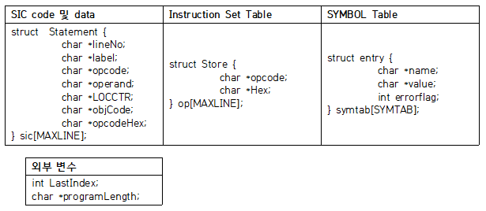
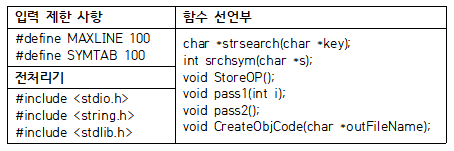
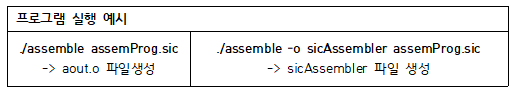

# SIC 어셈블러 개발
2019-2 시스템소프트웨어 SIC 어셈블러 프로젝트

The Simplified Instructional Computer Assembler

# 설계 이슈
## Architecture 설계이슈

### 1. CPU Micro-Instruction Set



### 2. Main Memory Capacity
전체 컴퓨터 메모리의 크기는 32,768(2^15)바이트이다.

### 3. Addressing Mode(s)
단순 주소 지정 방식(Simple addressing mode)으로 직접 주소 지정방식(Direct addressing mode)과 인덱스 주소 지정방식(Indexed addressing mode)을 사용한다.

직접 주소 지정방식은 Target Address, TA에 오퍼랜드의 address값을 그대로 사용(TA=address)하는 방식이고, 인덱스 주소지정방식은 오퍼랜드의 address값에 인덱스 레지스터의 내용을 더하여 TA를 결정(TA=address+(X))하는 방식이다.

### 4. CPU Instruction Format(s)
총 24-bit format으로 8-bit의 opcode, 1-bit의 flag bit, 15-bit의 address로 이루어져 있다.


### 5. Register(s)


### 6. 데이터 포맷(Data Formats)
24-bit 2진수 정수(Integer)와 8-bit ASCII 코드의 문자(Character)를 가진다. 음의 정수는 2의 보수로 표현한다.


## Assembler 설계이슈

### 1. 어셈블러의 아키텍처
Two-pass Assembler로 pass1과 pass2 동안 어셈블러 지시어를 처리하고 목적프로그램을 작성한다.

### 2. Micro-Instruction Set Table을 위한 데이터구조
모든 요소들을 Array형태로 나타내어 하나의 구조체로 묶어 구조체 배열로 표현하였다.

### 3. Micro-Instruction Set Table의 검색 알고리즘
이진 탐색 알고리즘을 사용하여 명령어를 검색하는 strsearch 함수를 작성하였다.

### 4. 어셈블리언어상의 Addressing Mode 표기방법





Indexed Addressing mode: 오퍼랜드에 ‘,x’로 입력받았을 때 flag bit에 1로 표기한 후 계산한다. 인덱스 주소지정 방식은 인덱스 레지스터의 내용과 address를 더하여 유효 주소를 결정한다. 인덱스 레지스터는 인덱스 값을 저장하는 특수 레지스터이다.

### 5. 어셈블리언어상의 Directive Instructions
- START: 프로그램의 시작주소와 이름을 나타낸다.
- END: 프로그램의 끝과 프로그램의 최초로 실행할 명령어의 위치를 나타낸다.
- BYTE: 문자 또는 16진수 상수를 생성하며, 상수가 차지하는 바이트 수를 나타낸다.
- WORD: 1-워드(3byte) 정수의 상수를 생성하며, 상수가 차지하는 워드 수를 나타낸다.
- RESB: 데이터 영역의 크기를 지시된 바이트 수만큼 예약한다.
- RESW: 데이터 영역의 크기를 지시된 워드 수만큼 예약한다.

### 6. 프로그램 Object Codes의 구조
object code는 각 명령어에 해당하는 opcode 2-bit와 오퍼랜드에 해당하는 location 값을 연결하여 표현한다.

이를 header record, text record, end record 세 부분으로 나누어 표현하였다.



## INPUT SPECIFICATIONS

1. 각 SIC 코드에는 순서의 맞는 Line Number가 있어야 하며 Line Number는 코드의 첫 번째 열에 위치해야 한다. Label 필드는 Line Number와 한개 이상의 공백으로 분리되어야 한다. 
2. Line Number는 첫 코드에서 5를 시작으로 5 간격으로 증가하여 매겨진다. 
3. 프로그램 코드의 Label은 두 번째 열에 위치해야 한다. 연산자 필드는 Label 필드와 한 개 이상의 공백으로 분리되어야 한다. Label이 없는 경우에 연산자 필드는 두 번째 열을 공백으로 한 후 세 번째 열에서 시작해야 한다.
4. Label은 1-6 문자로 구성된다. 첫 문자는 알파벳(A-Z) 이어야 한다. 나머지 문자들은 알파벳이거나 숫자(0~9)이면 된다. 또한 공백과 특수문자를 포함하여서는 안 된다.
5. 연산자 필드는 SIC opcode 이거나 BYTE, WORD, RESB, RESW, START, END 등의 어셈블러 지시자여야 한다.
6. 명령의 피연산자는 Symbol이거나 실제 기계의 주소를 나타내는 16진수이다. 0부터 FFFF까지의 값이어야 한다.
7. BYTE지시자의 16진 문자열 피연산자는 X’hhh...‘이어야 한다. 각 h는 16진수 한자리(0~9 A-F)를 나타내는 문자이다. 문자열의 최대길이는 32자리(메모리 16바이트를 나타내는)이다. 
8. BYTE지시자의 Char형 문자를 피연산자는 C’hhh’이어야 한다. 각 h는 ASCII 코드의 준하는 문자열이어야 한다. 하나의 ASCII 문자는 2개의 16진 숫자를 해당하므로 문자열의 최대길이는 7번에서 정한 규정의 반으로 한다. 
9. BYTE지시자의 2진 문자열 피연산자는 C’bbb’이어야 한다. 각 b는 0 또는 1 인 문자이다. 
10. 첫 명령어 코드는 위 사항을 준수하고 Label 필드에는 프로그램의 이름을 연산자 필드에는 START를 피연산자 필드에는 프로그램의 시작 주소(기계적 주소)를 작성해야한다. 
11. 두 번째 명령어 코드부터는 기능의 맞는 명령어를 입력하되 Label 필드에는 FIRST를 입력한다.
12. 마지막 명령어에는 Label 필드는 공백으로 하고 연산자 필드의 END와 피연산자 필드에 FIRST를 적어준다.
13. 모든 명령어의 4열부터는 comment로 처리하며 Label 필드의 . 이 입력될 경우 그 명령어 라인은 comment로 처리한다.
14. 소스 프로그램의 최대 LINE 수는 100으로 제한하며 한 LINE은 60 Column으로 제한한다.
15. 소스 프로그램의 최대 SYMBOL 수는 100으로 제한한다.


# Document

## 프로그램 실행 명령
```
./assembler assemProg.sic
./assembler assemProg.sic –o ObjectProg 
```



## 1. aGroup.h
팀 내에서 공통적으로 사용하는 변수와 구조체를 미리 약속하여 선언하는 헤더 파일이다.

선언된 구조체는 총 3가지이다. Statement 구조체는 입력파일에서 받아온 SIC 코드와 단계적인 과정에서 각 line에 저장되어야하는 값을 String을 가지는 구조체이다. Store 구조체는 Instruction Set Table로 각 opcode에 해당하는 Hex 값을 가지고 있다. entry 구조체는 SYMTAB로 symbol에 해당하는 locate 값과 errorflag 값을 가지고 있다.



외부변수로 선언된 변수는 int LastIndex 와 char *programLength이다. LastIndex는 #define MAXLINE 100으로 생성된 sic구조체 배열에서 사용하고 있는 배열 마지막 인덱스 값을 지칭한다. programLength는 sic 프로그램 전체 길이 값을 String으로 가지는 변수이다. 



그 외의 코드는 #include 전처리 코드와 입력 라인 제한과 SYMTAB 최대 저장 제한을 지칭하는 #define 코드이다. 또한 각 .c 파일에 함수들을 선언하여 상호적으로 호출할 수 있도록 하였다.

#define debug 1(or 0)으로 1일 때 각 연산 처리 결과 과정을 볼 수 있는 printf를 사용하고 0일 때는 success! Export File : 파일명(default : aout.o)만을 출력한다. 단 error 상황에서는 에러를 출력한다.

## 2. main.c

```int main(int argc, char* argv[])```



SIC 프로그램 입력 파일명은 argv[]로 ‘~.sic’를 받는다. 또한 ‘–o 출력파일명‘ 입력 시 출력파일명도 정할 수 있으며 ’-o’ 설정이 없으면 default :　‘aout.o’ 파일이 생성된다. 입력 형식이 잘못되었을 때를 방지하고자 else 문으로 예외 처리한다.

파일 입력 후 OPTAB생성을 위한 StoreOP 함수를 실행하며 입력된 SIC 프로그램은 strtok()하여 sic 구조체에 저장한다. Label이 없는 라인은 label = NULL 처리하고 opcode와 operand를 맞춰주고 sic 구조체 모든 성분은 동적 할당하여 토큰을 바로 참조함으로 내용이 바뀌는 문제를 해결하였다.

LOCCTR을 위한 StartAddress는 String으로 저장된 16진수를 정수형으로 변환하기 위해 정의된 AscConvert() 함수 호출한다. LOCCTR 과정에서 Opcode 검색함수인 strsearch()을 호출하여 sic[i].opcodeHex에 저장함으로 pass2에서는 Opcode를 다시 검사하지 않는다.

SIC 명령어 ‘BYTE’가 입력되었을 때는 문자(C), 2진(B), 16진(X)의 값을 처리할 수 있으며 이때 잘못된 입력형식에 대해 예외 처리한다.

LOCCTR 과정 후에는 pass1()함수를 호출하여 SYMTAB을 구성하고, pass2() 함수를 호출하여 목적코드를 생성하며, CreateObjCode() 함수를 호출하여 목적프로그램을 생성하고 파일로 출력한다.

## 3. instruction_set.c ①

``` void StoreOP() ```

명령어들을 저장하기 위한 함수이다. opcode와 16진수 형태 2가지를 저장하는 구조체 구조이다.

```char *strsearch(char *key)```

sic 구조체의 opcode를 읽으면 그 opcode의 16진수 형태를 찾아 반환해주는 함수이다. 이진 탐색 방식을 사용하였다. 만약 opcode가 아닌 경우 NULL값을 반환한다.


## 4. pass1.c ②

``` int lastentry=0 ```

심볼테이블에서 새로운 라벨이 들어갈 배열의 첨자 위치로 처음엔 심볼테이블에 아무 값이 없기 때문에 0으로 초기화한다.

``` int srchsym(char *s) ```
    
심볼테이블을 탐색하여 해당 문자열 s가 심볼테이블에 포함되어있는지 확인하는 함수이다. 심볼테이블의 처음부터 마지막 위치까지 검색하여 s가 symtab의 name과 같은지 확인하고 같으면 해당 symtab의 위치를 리턴하고, 같은 게 없으면 0을 리턴한다.

``` void pass1(int i) ```

sic 구조체의 label을 읽으며 심볼테이블을 만드는 함수이다. label을 읽고 srchsym 함수를 통해 기존 심볼테이블에 포함되어있는지 확인하여, 이미 포함되어 있다면 중복되지 않도록 errorflag를 1로 초기화한다. 포함되어 있지 않다면 심볼테이블에 작성해야하므로 symtab의 name에 label을 넣고, value에 label에 해당하는 location값을 넣는다. 그리고 lastentry를 하나 추가해 심볼테이블의 길이를 1만큼 추가한다.


## 5. pass2.c ③

``` void pass2() ```

pass1에서 구해진 LOCCTR와 SYMTAB, OPCODE(HEX) 값을 가지고 Object Code를 생성한다. 생성된 Object Code 는 sic 구조체에 Line 별로 저장된다. Object Code가 필요 없는 Line은 NULL을 저장한다.  

## 6. objectcode.c ④

pass1과 pass2 과정으로 만들어진 ObjectCode를 ObjectProgram으로 작성하여 출력파일을 생성하는 부분이다. 총 함수 4개로 이루어져있으며 다음과 같다.

``` void CreateObjCode(char *outFileName) ```

main() 함수에서 호출되어지는 함수로 object program 작성이 시작되는 함수이다. 각 Record 문자열 생성을 위해 char *HeaderRecord(), char *TextRecord(int *pStartIndex), char *EndRecord();을 호출한다. H Record와 E Record는 한 번 호출하고, T Record는 목적프로그램 크기에 따라서 while()문으로 반복 호출한다. T Record 함수 호출 시에는 반복문 밖에 변수를 주어 Index가 이어지도록 한다. 추가적으로 T Record의 시작 objCode 값이 NULL일 시에는 불필요한 T Record가 생성되므로 if문으로 걸러준다.

최종으로 생성된 object Program을 파일로 출력한다. 출력을 위해 함수의 인자로 출력파일명을 받아 저장한다. 

``` void *HeaderRecord() ```

Header Record는 col 1~19로 공백문자를 포함하면 char str[20]이 필요하다. Program Name은 col 2-7이므로 문자열 길이가 6보다 작으면 뒤에 공백을 추가해서 6자리를 맞춰준다. Program Start Address는 8-13이므로 6자리보다 작으면 0을 앞에 추가해야한다. 추가는 정의한 addzero() 함수를 이용한다. 반환할 문자열은 동적 할당하여 메모리를 할당한다.

``` void *TextRecord(int *pStartIndex) ```

Text Record는 object Code의 시작주소를 먼저 저장한다. 시작주소는 col 2-7이므로 6자리를 맞추기 위해 addzero() 함수를 사용하여 앞에 0을 붙인다. col 10-69는 object Code를 반복하여 char strbuffer[60]에 이어 붙여 저장하면서 바이트를 계산하고 총 계산된 바이트 크기는 col 8-9에 저장한다. 반복은 다음 저장할 object Code의 길이로 인해 60 col이 넘으면 저장하지 않고 종료한다.  

``` void *EndRecord() ```

End Record는 sic[0].operand에서 프로그램 시작주소를 가져와 저장한다. col 2-7이므로 6자리를 맞추기 위해 addzero() 함수를 사용하여 앞에 0을 붙인다. 
  
``` void *addZero(char * strHex, int len) ```

strHex 문자열의 길이가 len이 될 때까지 문자열 앞에 0을 붙인다.

---

# Developer

